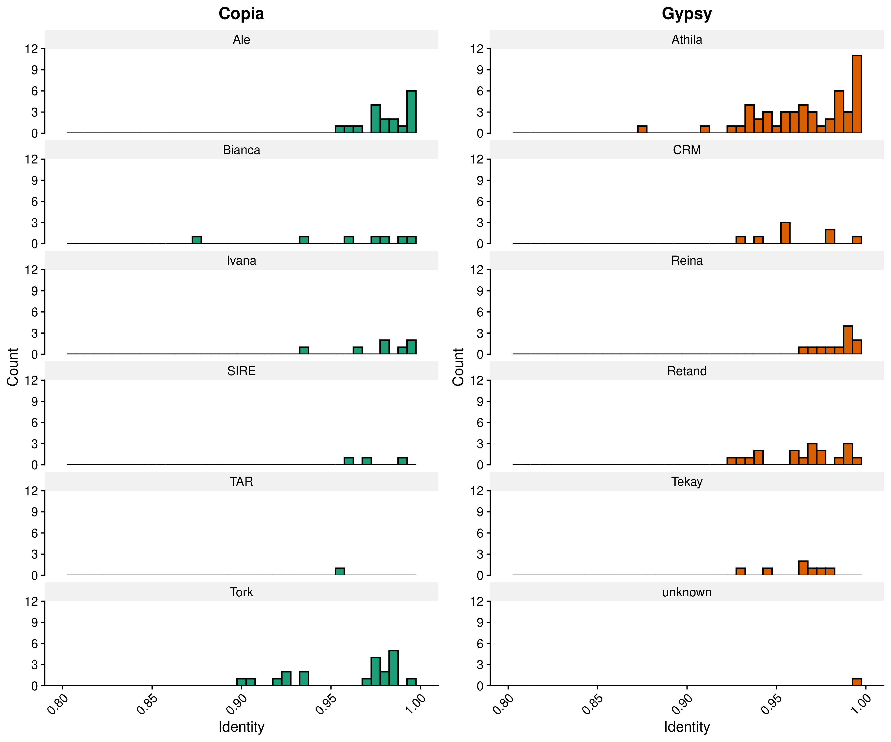
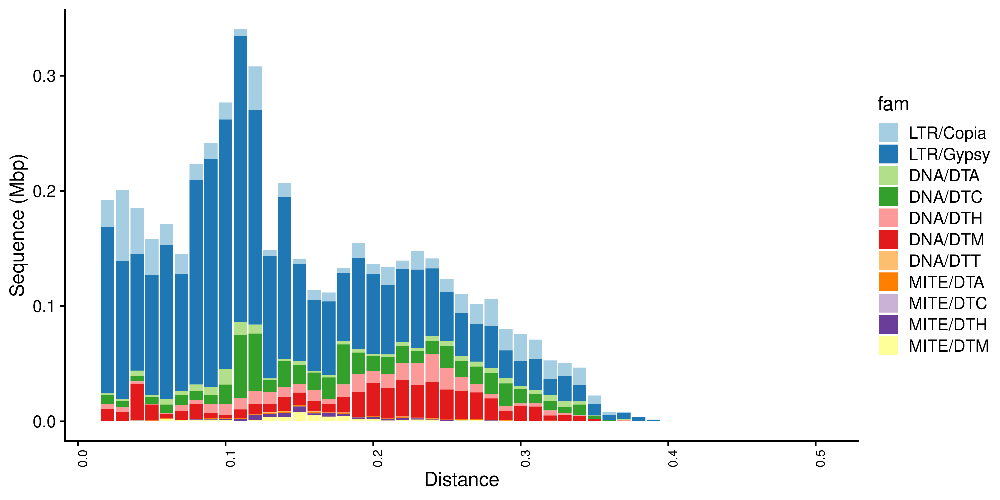
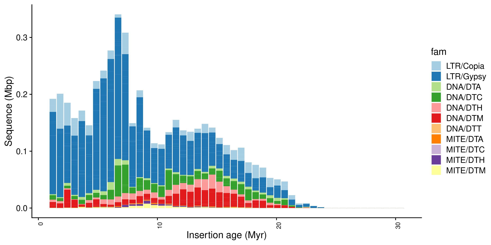
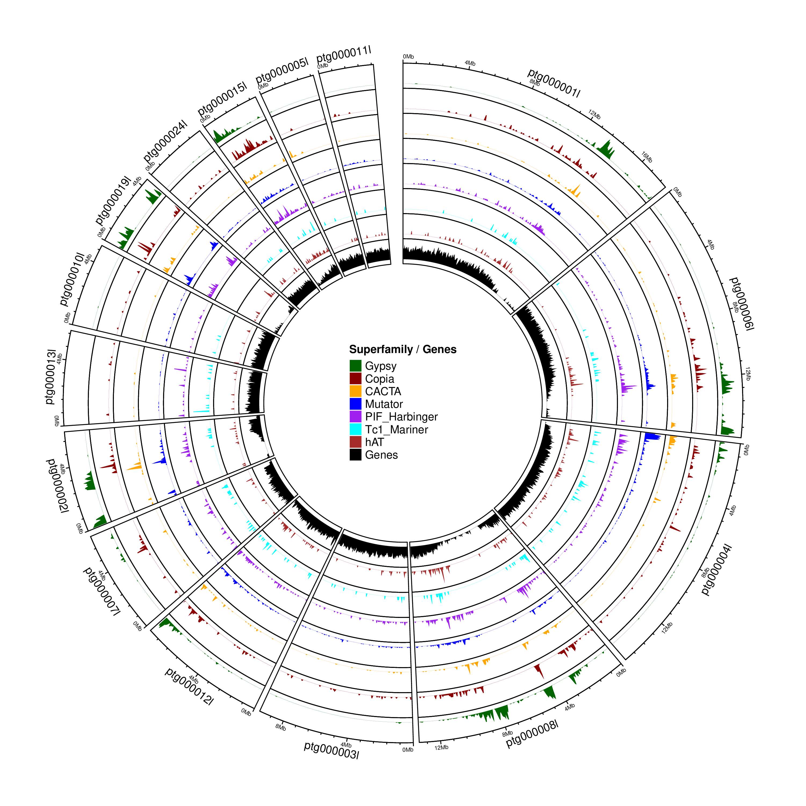
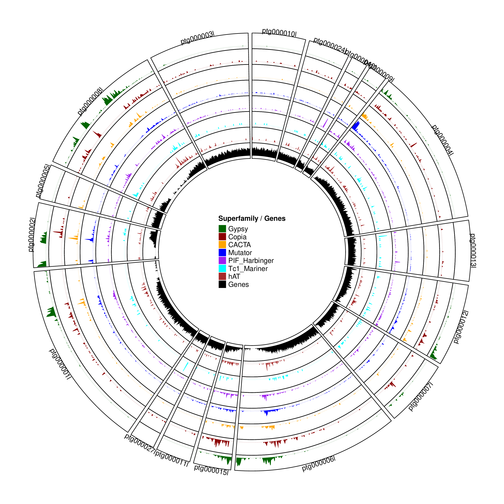
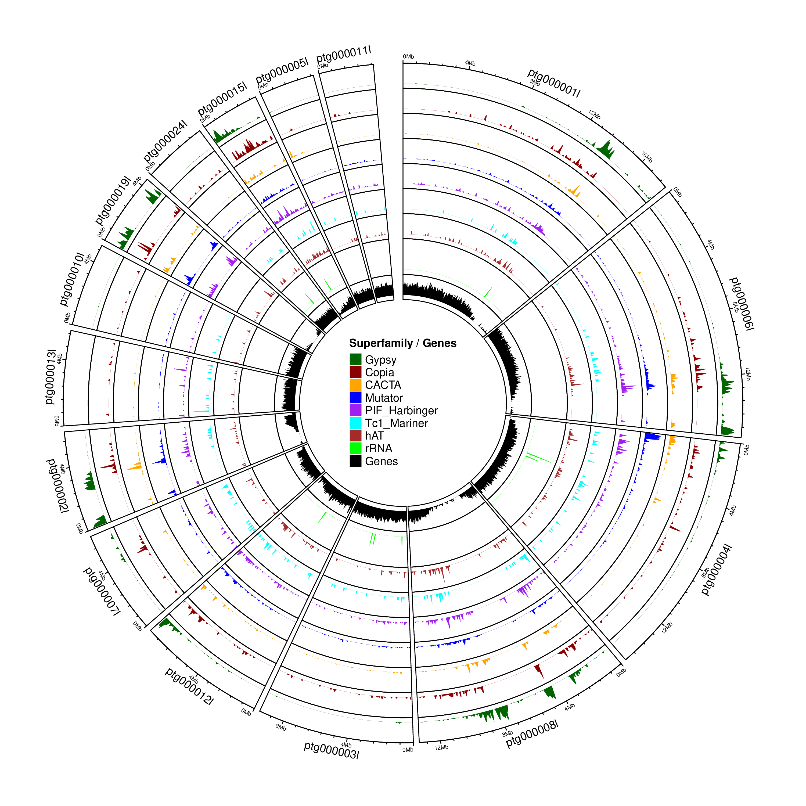
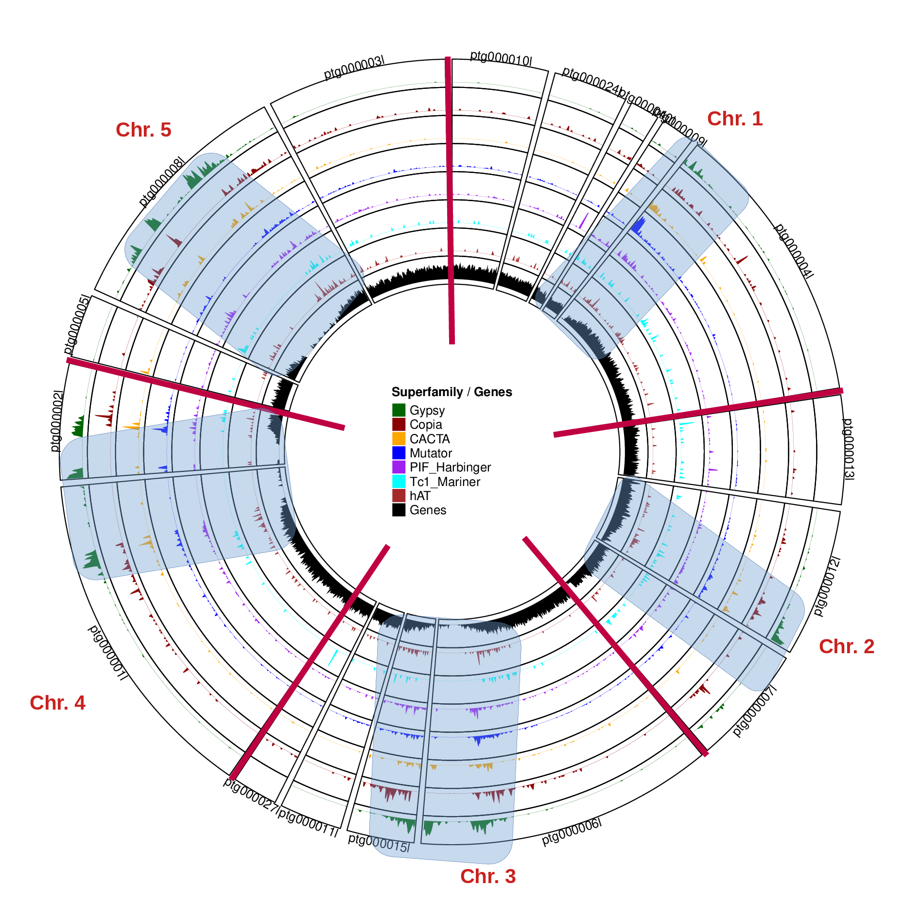
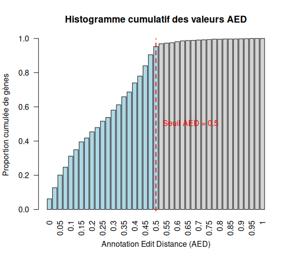
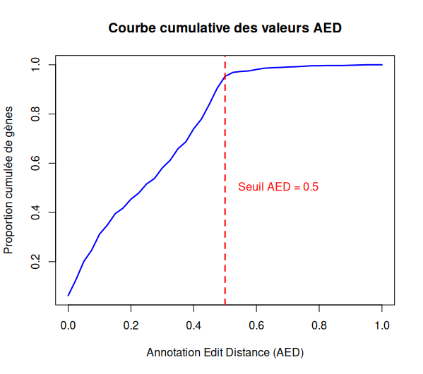
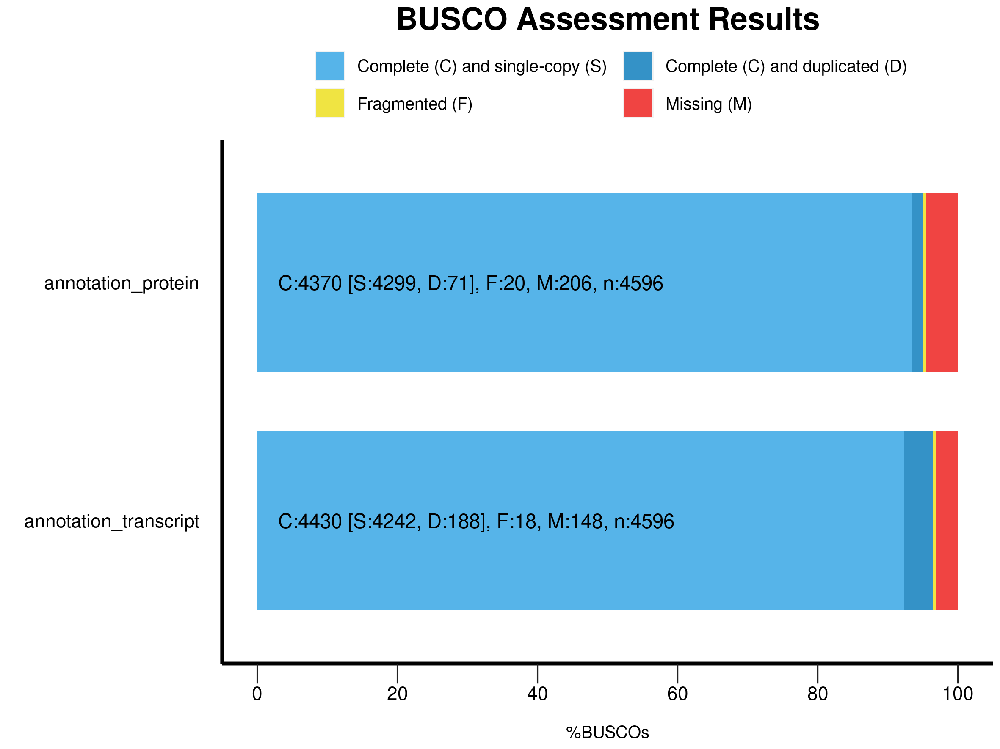

# Report - Organization and Annotation of Eukaryote Genomes

**Student**: Charrière Noé

## Introduction

This report summarizes the analyses performed during the “Organization and Annotation of Eukaryote Genomes” practical course.  
The goal was to perform transposable elements annotation and classification, annotation of genes with the MAKER Pipeline, orthology based gene functional annotation and genome comparisons.  
All commands and tool versions are documented in the README; this report focuses exclusively on the obtained results.  

## Results

### Figure 01 - full LTR retrotransposon  

  

Figure 01. *This figure shows the number of full-length LTR retrotransposons detected in the genome. These complete elements include both LTRs and internal coding domains, indicating potentially intact or recently active transposons. Their abundance highlights the important role of LTR elements in shaping genome structure and evolution.*

### Figure 02 - TE landscape

#### Figure 02a - TE landscape  

  

Figure 02a. *This figure show the distribution of transposable elements (TEs) in the genome based on their divergence from the consensus sequence. The X-axis represents percent divergence, while the Y-axis shows the sequence amount in Mbp for each TE superfamily. Peaks at low divergence (or low age) indicate recent TE activity, whereas broader peaks at higher values reflect older waves of insertions.*  

#### Figure 02b - TE landscape with age  

  

Figure 02b. *This figure show the distribution of transposable elements (TEs) in the genome based on the estimated insertion age (in million years) using the substitution rate. The X-axis represents estimated insertion age, while the Y-axis shows the sequence amount in Mbp for each TE superfamily.*

### Figure 03 - Genome circular overview

#### Figure 03a - Contigs ordered by size  

  

Figure 03a. *This circular plot shows the distribution of transposable elements (TEs) by superfamily and the proportion of genes across contigs, which are ordered by decreasing size. Each ring represents a different TE superfamily or gene density. The gene density is obtained by gene annotation with MAKER (to be precise it's the merging and filtering of the MAKER output that gave the gene density). Peaks indicate regions with higher TE or gene content. This view highlights the overall structure of the genome and major TE-rich or gene-rich regions. (I didn't put the intermediate versions without the gene density, it didn't add anything)*

#### Figure 03b - Contigs ordered by chromosomal location  

  

Figure 03b. *Here, contigs are ordered according to their inferred chromosomal positions based on GENESPACE comparisons with TAIR10. This representation allows the identification of conserved genomic regions, showing how TE and gene distribution patterns relate to chromosome organization. Comparisons with Figure 03a illustrate the differences between size-based and chromosomal ordering.*

#### Figure 03c - TE and rRNA localization  

  

Figure 03c. *This circular plot overlays rRNA loci on the previous visualization. rRNAs are normally expected at two canonical locations (nucleolar organizer regions, NORs, on chromosomes 2 and 4), but additional expressed rRNA regions are observed in this genome.*

#### Figure 03d - Contigs ordered by chromosomal location with centromeres  

  

Figure 03d. *This final circos plot builds on Figure 03b by adding the locations of centromeres (in blue) and chromosome boundaries (in red). Most centromeres appear split across different contigs, which is expected due to the highly repetitive nature of these regions.*

### Figure 04 - Summary table of EDTA  

| Class     | Subtype        | Count  | bp Masked | % Masked |
|-----------|----------------|-------:|----------:|---------:|
| LINE      |                | --     | --        | --       |
|           | L1             | 1014   | 613124    | 0.38%    |
| LTR       |                | --     | --        | --       |
|           | Copia          | 987    | 1022109   | 0.63%    |
|           | Gypsy          | 2767   | 3855525   | 2.40%    |
|           | unknown        | 7236   | 7523764   | 4.67%    |
| SINE      |                | --     | --        | --       |
|           | tRNA           | 1549   | 1728290   | 1.07%    |
| TIR       |                | --     | --        | --       |
|           | CACTA          | 775    | 630847    | 0.39%    |
|           | Mutator        | 1962   | 1016227   | 0.63%    |
|           | PIF_Harbinger  | 1019   | 429237    | 0.27%    |
|           | Tc1_Mariner    | 208    | 77443     | 0.05%    |
|           | hAT            | 516    | 172673    | 0.11%    |
| nonLTR    |                | --     | --        | --       |
|           | pararetrovirus | 19     | 28616     | 0.02%    |
| nonTIR    |                | --     | --        | --       |
|           | helitron       | 7242   | 4310027   | 2.68%    |
| rDNA      |                | --     | --        | --       |
| rDNA      | 45S            | 3125   | 2412227   | 1.50%    |
| Total     | -              | 29970  | 24230307  | 15.05%   |

Figure 04. *Summary of transposable element (TE) annotation from EDTA. Columns indicate the TE class, subtype (if applicable), number of sequences, total bases masked, and percentage of the genome masked. Totals for all elements are provided at the bottom.*

### Figure 05 - AED score distribution plots  

  

  

Figure 05. *Distribution of AED (Annotation Edit Distance) scores for gene models predicted in the genome. Panel (a) shows a cumulative barplot of AED scores, indicating the proportion of genes with different levels of agreement to supporting evidence (transcripts or protein homology). Panel (b) shows a cumulative distribution plot of AED scores across all gene models. Low AED scores (closer to 0) indicate gene models well supported by evidence, while higher scores (closer to 1) represent less supported predictions. Overall, these plots provide an overview of the quality and reliability of the gene annotation. Nearly 100% (0.953% to be precise) of gene models have AED ≤ 0.5, reflecting high annotation quality.*

### Figure 06 - busco assessment Results  

  

Figure 06. *BUSCO analysis of the genome annotations using the Brassicales odb10 lineage dataset (n = 4596 BUSCO groups). Panel (a) shows results for the protein annotation: 95.0% of BUSCOs are complete (93.5% single-copy, 1.5% duplicated), 0.4% are fragmented, and 4.6% are missing. Panel (b) shows results for the transcript annotation: 96.4% complete (92.3% single-copy, 4.1% duplicated), 0.4% fragmented, and 3.2% missing. These high percentages of complete BUSCOs indicate a high-quality and comprehensive annotation for both protein-coding genes and transcript models.*

### Figure 07 - functional annotation

| Genes with Blast hits |                | Genes without Blast hits |               |
|-----------------------|----------------|--------------------------|---------------|
| TAIR10: 35827         | Uniprot: 29305 | TAIR10: 851              | Uniprot: 7373 |

