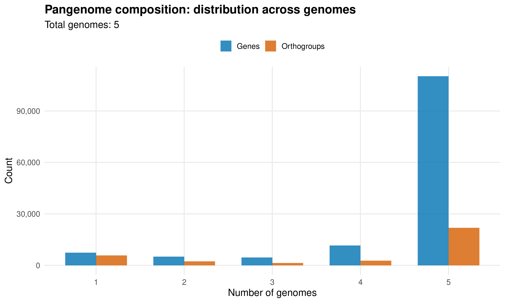
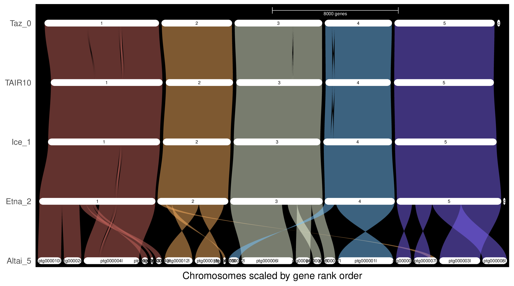

Charrière Noé - Altai-5 - https://github.com/ncharriere/Genome_annotation

# Report - Organization and Annotation of Eukaryote Genomes

**Student**: Charrière Noé

## Introduction

This report summarizes the analyses performed during the “Organization and Annotation of Eukaryote Genomes” practical course.  
The analyses included:
- annotation and classification of transposable elements (TEs),
- gene annotation using the MAKER pipeline,
- assessment of annotation quality (AED and BUSCO),
- functional annotation using homology searches,
- orthology inference and comparative genomics across accessions.

All commands, intermediate scripts and tool versions are documented in the GitHub repository (https://github.com/ncharriere/Genome_annotation).  
Here, only the selected figures and tables are presented, each accompanied by an extended legend describing (1) what is shown, (2) how to interpret the figure, and (3) the key biological insights.  

## Results

### Figure 01 - full LTR retrotransposon  

  

Figure 01. *Distribution of LTR identity across clades for the two major LTR superfamilies (Copia on the left; Gypsy on the right).*
*Each panel (Copia on the left, Gypsy on the right) shows, for several named clades (e.g., Tork, TAR, SIRE, Bianca, Tekay, Retand, Reina, CRM, Athila…), a histogram of the number of elements (vertical axis; scale 0–12) as a function of their identity (horizontal axis; roughly 0.80–1.00).*  
*“Identity” represents the similarity between paired LTRs (or to the consensus sequence) and serves as a proxy for insertion age: values close to 1.00 correspond to recent insertions with little divergence, while lower values indicate older, more degraded insertions.*  
*The peaks or distributions within each clade reflect how many elements group within a given identity range.
Some clades display pronounced peaks at high identity values (≈0.95–1.00), indicating recent waves of LTR activity in these specific lineages.*  
*Other clades show broader distributions skewed toward lower identities, consistent with older, more diverged insertions. This clade-dependent pattern suggests differentiated transpositional dynamics among LTR families, with some clades contributing more recently to genome expansion.*

### Figure 02 - TE landscape

#### Figure 02a - TE landscape  

  

Figure 02a. *TE abundance plotted against sequence divergence from consensus.*  
*The X-axis shows percent divergence; the Y-axis indicates megabases of sequence. Low divergence corresponds to young insertions; high divergence to older ones.*  
*Several TE families show peaks at low divergence, indicating recent or ongoing TE activity. This is particularly strong for LTR retrotransposons, consistent with the high number of full-length LTRs in Figure 01.*

#### Figure 02b - TE landscape with age  

  

Figure 02b. *TE age distribution based on estimated substitution rates.*  
*The X-axis shows estimated insertion age in million years; the Y-axis the total Mbp of TE content.*  
*The distribution confirms several waves of LTR retrotransposition, including young insertions < 2 My old. Such recent bursts may contribute significantly to local genome expansion and structural variation.*  
*A plausible explanation for the 6 – 8 Myr peak is an ancient evolutionary event that temporarily disrupted transposon silencing. This could include an old hybridization event, a genome-wide epigenetic crisis, a period of strong environmental stress, or large-scale chromosomal rearrangements. Such events could have triggered bursts of LTR activity in Brassicaceae and would fit well with the observed age distribution.*

### Figure 03 - Genome circular overview

#### Figure 03a - Contigs ordered by size  

  

Figure 03a. *This circular plot shows the distribution of transposable elements (TEs) by superfamily and the proportion of genes across contigs, which are ordered by decreasing size. Each ring represents a different TE superfamily or gene density. The gene density is obtained by gene annotation with MAKER (to be precise it's the merging and filtering of the MAKER output that gave the gene density). Peaks indicate regions with higher TE or gene content. This view highlights the overall structure of the genome and major TE-rich or gene-rich regions. (I didn't put the intermediate versions without the gene density, it didn't add anything)*

#### Figure 03b - Contigs ordered by chromosomal location  

  

Figure 03b. *Here, contigs are ordered according to their inferred chromosomal positions based on GENESPACE comparisons with TAIR10. This representation allows the identification of conserved genomic regions, showing how TE and gene distribution patterns relate to chromosome organization. Comparisons with Figure 03a illustrate the differences between size-based and chromosomal ordering.*

#### Figure 03c - TE and rRNA localization  

  

Figure 03c. *This circular plot overlays rRNA loci on the previous visualization. rRNAs are normally expected at two canonical locations (nucleolar organizer regions, NORs, on chromosomes 2 and 4), but additional expressed rRNA regions are observed in this genome.*

#### Figure 03d - Contigs ordered by chromosomal location with centromeres  

  

Figure 03d. *This final circos plot builds on Figure 03b by adding the locations of centromeres (in blue) and chromosome boundaries (in red). Most centromeres appear split across different contigs, which is expected due to the highly repetitive nature of these regions.*

### Figure 04 - Summary table of EDTA  

| Class     | Subtype        | Count  | bp Masked | % Masked |
|-----------|----------------|-------:|----------:|---------:|
| LINE      |                | --     | --        | --       |
|           | L1             | 1014   | 613124    | 0.38%    |
| LTR       |                | --     | --        | --       |
|           | Copia          | 987    | 1022109   | 0.63%    |
|           | Gypsy          | 2767   | 3855525   | 2.40%    |
|           | unknown        | 7236   | 7523764   | 4.67%    |
| SINE      |                | --     | --        | --       |
|           | tRNA           | 1549   | 1728290   | 1.07%    |
| TIR       |                | --     | --        | --       |
|           | CACTA          | 775    | 630847    | 0.39%    |
|           | Mutator        | 1962   | 1016227   | 0.63%    |
|           | PIF_Harbinger  | 1019   | 429237    | 0.27%    |
|           | Tc1_Mariner    | 208    | 77443     | 0.05%    |
|           | hAT            | 516    | 172673    | 0.11%    |
| nonLTR    |                | --     | --        | --       |
|           | pararetrovirus | 19     | 28616     | 0.02%    |
| nonTIR    |                | --     | --        | --       |
|           | helitron       | 7242   | 4310027   | 2.68%    |
| rDNA      |                | --     | --        | --       |
| rDNA      | 45S            | 3125   | 2412227   | 1.50%    |
| Total     | -              | 29970  | 24230307  | 15.05%   |

Figure 04. *Summary of transposable element (TE) annotation from EDTA. Columns indicate the TE class, subtype (if applicable), number of sequences, total bases masked, and percentage of the genome masked. Totals for all elements are provided at the bottom.*  
*The genome is ~15% repetitive, dominated by Gypsy LTRs and Helitrons, which is consistent with Brassicaceae genomes.*

### Figure 05 - AED score distribution plots  

  

  

Figure 05. *Distribution of AED (Annotation Edit Distance) scores for gene models predicted in the genome. Panel (a) shows a cumulative barplot of AED scores, indicating the proportion of genes with different levels of agreement to supporting evidence (transcripts or protein homology). Panel (b) shows a cumulative distribution plot of AED scores across all gene models. Low AED scores (closer to 0) indicate gene models well supported by evidence, while higher scores (closer to 1) represent less supported predictions. Overall, these plots provide an overview of the quality and reliability of the gene annotation. Nearly 100% (0.953% to be precise) of gene models have AED ≤ 0.5, reflecting high annotation quality.*

### Figure 06 - busco assessment Results  

  

Figure 06. *BUSCO analysis of the genome annotations using the Brassicales odb10 lineage dataset (n = 4596 BUSCO groups). Panel (a) shows results for the protein annotation: 95.0% of BUSCOs are complete (93.5% single-copy, 1.5% duplicated), 0.4% are fragmented, and 4.6% are missing. Panel (b) shows results for the transcript annotation: 96.4% complete (92.3% single-copy, 4.1% duplicated), 0.4% fragmented, and 3.2% missing. These high percentages of complete BUSCOs indicate a high-quality and comprehensive annotation for both protein-coding genes and transcript models.*

### Figure 07 - functional annotation  

**Number of filtered genes**: 36,678

**Genes with Blast hits**
| TAIR10: | Uniprot: |
|---------|----------|
| 35827   | 29305    |

**Genes without Blast hits**
| TAIR10: | Uniprot: |
|---------|----------|
| 851     | 7373     |

Figure 07. *The functional annotation shows that most of the 36,678 filtered genes could be assigned a putative function based on sequence similarity. Using TAIR10, 35,827 genes (≈97.7%) received a BLAST hit, while 29,305 genes (≈79.9%) matched proteins in UniProt. The higher success rate with TAIR10 likely reflects its close phylogenetic relationship to the annotated species. Overall, the high proportion of annotated genes indicates that the predicted gene set is of good quality and consistent with known Brassicales genomes.*

### Figure 08 - Orthogroup Summary  

| Category                          | Value |
|-----------------------------------|-------|
| Core orthogroups:                 | 20360 |
| Accession-specific orthogroups:   | 0     |
| Accession-specific genes:         | 0     |
| Shared with TAIR10 (orthogroups): | 22031 |
| Shared with TAIR10 (genes):       | 29290 |

Figure 08. *Using the Orthogroups.GeneCount.tsv file, we quantified gene sharing patterns across accessions. A total of 20,360 core orthogroups were identified, meaning they are shared by all compared accessions. No accession-specific orthogroups were detected, indicating that all orthogroups containing genes from the studied accession also include genes from at least one other accession. When comparing specifically with TAIR10, the analysis reveals 22,031 shared orthogroups, corresponding to 29,290 shared genes, demonstrating a high level of conservation between our annotated genome and the reference Arabidopsis thaliana TAIR10 annotation.*

### Figure 09 - plot of number of orthogroups (gene families) against number of accession  

  

Figure 09. *This plot shows how many orthogroups (gene families) are shared across different numbers of accessions. The left side of the distribution corresponds to rare or accession-specific orthogroups, while the right side represents core orthogroups found in all accessions. In our dataset, the curve is strongly skewed toward the right, indicating that the vast majority of orthogroups are shared by all accessions. Very few orthogroups occur in only one or a few accessions, suggesting a highly conserved gene content and limited accession-specific gene innovation.*

### Figure 10 - Riparian plots

  

Figure 10. *Riparian plot showing gene synteny across multiple Brassicaceae genomes.*  
*Each horizontal bar represents a genome or accession (Taz_0, TAIR10, Ice_1, Etna_2 and my Altai_5), with genes ordered according to their inferred chromosomal positions based on Genespace analysis. Colored bands connect orthologous genes between genomes. Continuous, dense bands indicate conserved syntenic blocks, while gaps or thinning of bands reflect gene insertions/deletions, loss, or structural rearrangements.*
*The plot demonstrates that gene order is largely conserved across all accessions, consistent with the high number of core orthogroups reported in Figures 8–9. However, some contigs in our accession are oriented opposite to the other accessions. Most of the Altai-5 genome can be rearranged to match the other accessions, except for contig ptg000007l, which appears partially linked to chromosomes 2 and 5, a configuration that is most likely an error.*

### Figure 11 - Genespace dotplots

## Conclusion  

The analyses performed provide a comprehensive characterization of the Altai-5 genome. Transposable element annotation highlights recent LTR activity and a TE composition typical of Brassicaceae. Gene annotation quality is high, as reflected by excellent AED and BUSCO scores, and functional annotation assigns putative roles to nearly all predicted genes, particularly using the TAIR10 reference. Comparative genomics and orthology analyses reveal strong conservation with reference genomes and across accessions, while synteny visualizations from Genespace confirm largely preserved gene order with a few structural discrepancies. Altogether, these results demonstrate both the complexity of eukaryotic genome annotation and the robustness of the pipelines applied in this study.